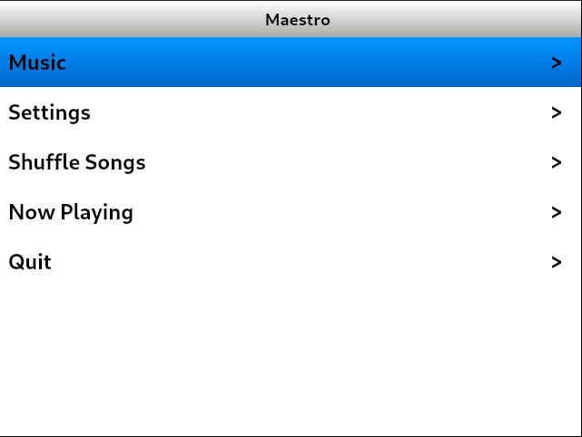
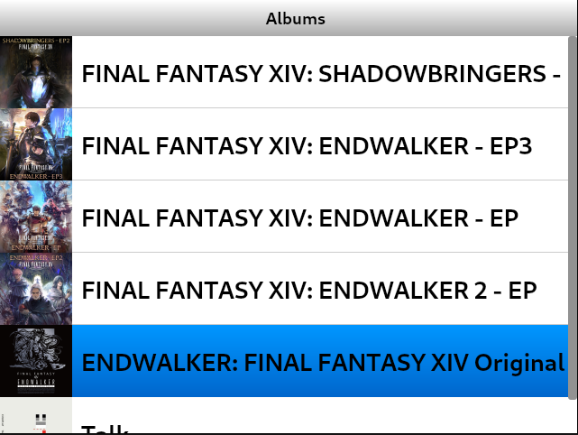
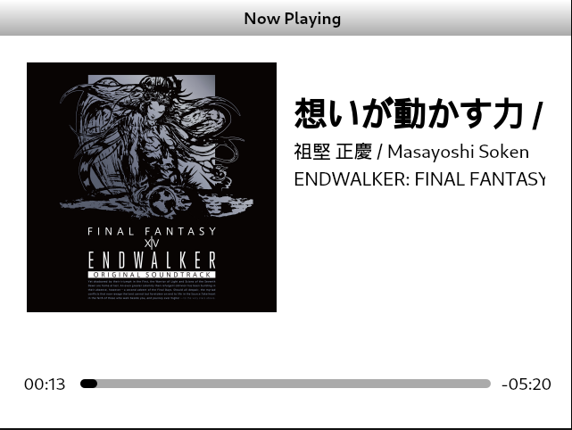

<h1 align="center"><b>Maestro</b></h1>
<h4 align="center">An iPod inspired GUI music player</h4>

## Screenshots

## Status

## Feature
- Lightweight and compact, tested on a Raspberry Pi 2W
- Privacy focused, every bits of data is kept locally
- Battery-conscious design, support longer usage time
- Support various input methods, including keyboard/mouse and gamepad
- Written with Qt, easy to maintain

## Dependencies
- g++
- cmake
- libtag1-dev
- qtbase5-dev
- qt5-qmake
- qtbase5-dev-tools
- libqt5gui5
- libqt5sql5
- libqt5multimedia5
- libqt5multimediawidgets5
- libqt5gamepad5-dev
- qtmultimedia5-dev \
- qtconnectivity5-dev

## Credits
- Icons by [Artur Lopato](https://thenounproject.com/creator/lopato/)
- Icons by [Graphixs_Art](https://thenounproject.com/creator/Graphixs_Art/)
- Icons by [Styfico](https://thenounproject.com/creator/styfico/)

## License
This program is under GNU GENERAL PUBLIC LICENSE Version 3, 29 June 2007.

Copyright (C) 2025 Khoa Nguyen (Risky/Reesque)
