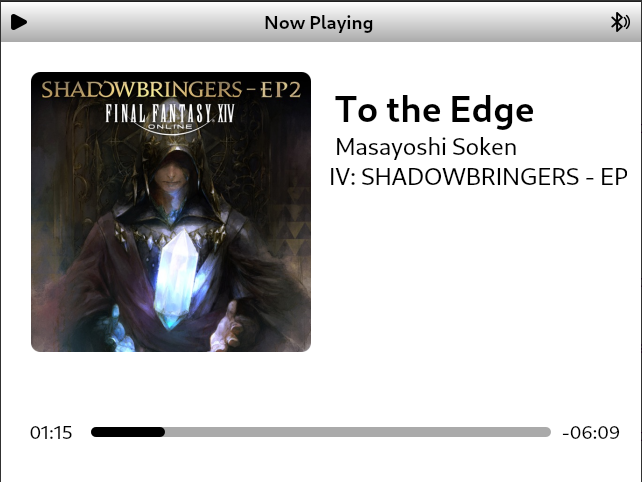

<h1 align="center"><b>Maestro</b></h1>
<h4 align="center">An iPod inspired GUI music player</h4>

## Screenshots

## Feature
- Lightweight and compact, tested on a Raspberry Pi 2W
- Privacy focused, every bits of data is kept locally
- Battery-conscious design, support longer usage time
- Support various input methods, including keyboard/mouse and gamepad
- Written with Qt, easy to maintain

## Credits
- Icons by [Artur Lopato](https://thenounproject.com/creator/lopato/)

## License
This program is under GNU GENERAL PUBLIC LICENSE Version 3, 29 June 2007.

Copyright (C) 2025 Khoa Nguyen (Risky/Reesque)
